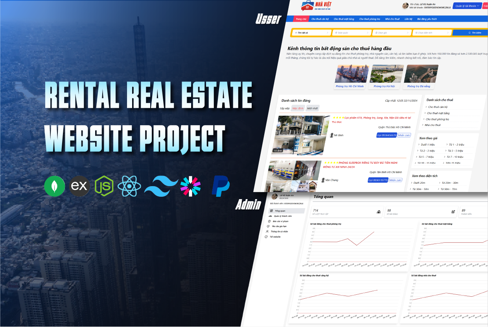

<div align="center">
<h3 align="center">NHA VIET WEBSITE</h3>
<p align="center"> A modern MERN Stack marketplace for posting, browsing, and managing real estate listings, connecting property owners and renters with ease.
</p>
 
[](LICENSE) [](https://nodejs.org) [](https://react.dev) [](https://www.mongodb.com)
 
[Demo](https://nhaviet.onrender.com/) · [Github]([../../issues](https://github.com/levuxuananit/mern-nhaviet))

</div>

---

## Table of Contents

- [Table of Contents](#table-of-contents)
- [1. About ](#1-about-)
- [2. Tech Stack ](#2-tech-stack-)
- [3. Features ](#3-features-)
- [4. Getting Started ](#4-getting-started-)
  - [4.1. Prerequisites ](#41-prerequisites-)
  - [4.2. Installation ](#42-installation-)
  - [4.3. Environment Variables ](#43-environment-variables-)
  - [4.4. Running Locally ](#44-running-locally-)
- [5. Contact ](#5-contact-)
- [6. Acknowledgements ](#6-acknowledgements-)

## 1. About <a name = "about"></a>



**[Nha Viet](https://nhaviet.onrender.com/)** is a full-stack MERN (MongoDB, Express, React, Node.js) web application designed to connect property owners, landlords, and tenants in a fast, secure, and user-friendly marketplace for real estate listings.

Users can post, browse, and search for properties and rental rooms by location, price range, and category, upload images via Cloudinary, and communicate through built-in comments. Built with JWT-based authentication, RESTful APIs, and a responsive React frontend, **[Nha Viet](https://nhaviet.onrender.com/)** streamlines the process of listing and finding real estate making property discovery simple for both hosts and renters.

## 2. Tech Stack <a name = "tech-stack"></a>

- Frontend
  - React 18
  - React Router
  - Axios
  - Redux / Context API
  - CSS Modules / TailwindCSS

- Backend
  - Node.js + Express
  - MongoDB + Mongoose
  - JSON Web Token (JWT) authentication
  - Cloudinary (image storage)
  - Nodemailer (email service)

## 3. Features <a name = "features"></a>

- Guest
  - Search & browse room listings
  - View listing details
  - View news & articles
  - View service pricing table
  - Register an account

- User
  - Authentication (login, logout, password recovery)
  - Account management (update profile, change password/phone number)
  - Listing management (create, update, delete, search own listings)
  - Post rental listings
  - Save listings to favorites
  - Listing payment & payment history
  - Search, browse & view listing details
  - View news & service pricing

- Admin
  - Admin authentication (login/logout)
  - User management (view & delete accounts)
  - Listing management (view, review, approve/reject, delete)
  - Service pricing management (view & update)
  - Revenue dashboard & analytics
  - Export revenue reports

## 4. Getting Started <a name = "getting-started"></a>

Follow these steps to set up the project locally.

### 4.1. Prerequisites <a name = "prerequisites"></a>

- [Node.js](https://nodejs.org/)
- [npm](https://www.npmjs.com/)
- [MongoDB Atlas](https://www.mongodb.com/atlas) (or local MongoDB instance)
- [Cloudinary](https://cloudinary.com/) (for image uploads)

### 4.2. Installation <a name = "installation"></a>

```bash
# 1. Clone the repository
git clone https://github.com/<your-username>/nha-viet.git
cd nha-viet

# 2. Install dependencies for both client and server
npm run install-server
npm run install-client
```

### 4.3. Environment Variables <a name = "environment-variables"></a>

Create a `.env` file inside `server/` with the following variables:

```env
PORT=5000
NODE_ENV=development
CLIENT_URL=http://localhost:3000

MONGODB_URL=your_mongodb_connection_string

SECRET_KEY=your_jwt_secret_key

CLOUDINARY_NAME=your_cloudinary_name
CLOUDINARY_KEY=your_cloudinary_key
CLOUDINARY_SECRET=your_cloudinary_secret

EMAIL_NAME=your_email_address
EMAIL_APP_PASSWORD=your_email_app_password
```

> ⚠️ **Never commit your `.env` file.** Make sure it's listed in `.gitignore`. Use `.env.example` to document required keys without exposing real values.

### 4.4. Running Locally <a name = "running-locally"></a>

**Option A — Run client and server separately (recommended for development, with hot reload):**

```bash
# Terminal 1 — API server
cd server
npm run start

# Terminal 2 — React dev server
cd client
npm start
```

Client will run on `http://localhost:3000`, API on `http://localhost:5000`.

**Option B — Run as a single production-like server:**

```bash
npm run build     # builds the client and installs server deps
npm run start     # serves both API and static client from one port
```

Visit `http://localhost:5000`.

## 5. Contact <a name = "contact"></a>

- **[Lê Vũ Xuân An](https://levuxuanan-portfolio.vercel.app/)** - Mail: levuxuanan.it@gmail.com
- Project Link: [https://github.com/levuxuananit/mern-nhaviet](https://github.com/your-username/nha-viet)
- Demo Link: [https://nhaviet.onrender.com/](https://nhaviet.onrender.com/)

## 6. Acknowledgements <a name = "acknowledgement"></a>

- [Express.js](https://expressjs.com/)
- [React](https://react.dev/)
- [MongoDB](https://www.mongodb.com/)
- [Cloudinary](https://cloudinary.com/)
